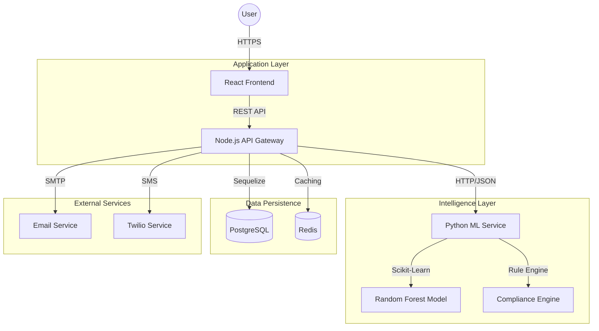

# CollectIQ

[](.)
[](.)
[](.)
[](.)
[](LICENSE)

## Problem Statement
Debt collection in the enterprise logistics sector suffers from inefficiency and high legal risk. Manual case assignment processes often lead to suboptimal resource allocation and lower recovery rates. More critically, the lack of real-time, automated compliance checks exposes organizations to significant liability under regulations such as the FDCPA and TCPA, where a single violation can result in costly lawsuits. Traditional performance metrics also fail to account for compliance adherence, creating misaligned incentives for collection agencies.

## Solution Overview
CollectIQ is an autonomous debt collection management platform designed to optimize recovery operations while strictly enforcing regulatory compliance. It replaces manual workflows with intelligent case routing, a real-time compliance guardrail engine, and a multi-factor vendor performance evaluation system. By integrating machine learning with deterministic rule sets, the platform ensures that high-value cases are prioritized and that all communications strictly adhere to legal standards.

## Key Features

### 🧠 Core Intelligence
- **AI-Based Risk Scoring:** Predictive modeling (Random Forest) assigns payment probability (0-100%) and categorizes cases by priority/risk level upon ingest.
- **Real-Time Compliance Engine:** A deterministic rule engine validates every communication attempt (Email/SMS) against FDCPA and TCPA regulations before execution.
- **Intelligent Auto-Assignment:** Algorithmic routing considers collector capacity (30%), BPI score (40%), complexity match (20%), and SLA risk (10%).

### 📊 Governance & Analytics
- **Balanced Performance Index (BPI):** Fairly evaluates vendors using a weighted score:
  - *Recovery Rate (40%)*
  - *Compliance Score (30%)* (Hard cap: 0 if violated)
  - *SLA Adherence (20%)*
  - *Complaint Penalty (-10%)*
- **Immutable Audit Trail:** Comprehensive, database-level logging of all system actions to ensure transparency.
- **Multi-Format Export:** Native generation of Executive Summaries (PDF), Analysis Data (CSV), and Compliance Reports (DOCX).

### 🎨 Recent UI/UX Enhancements
- **Advanced Dashboard:** Interactive tables with server-side sorting (Amount, Overdue, Priority) and status filtering (Assigned/In-Progress).
- **Global Search:** Instant lookup by Customer Name, Email, or Case ID across the entire platform.
- **Mobile Responsive:** Fully optimized layout for tablets and mobile devices with horizontal scrolling tables and stacked analytical cards.
- **Secure Downloads:** Secure Blob-based file transmission for all report exports.

## Tech Stack
- **Frontend:** React 18, TypeScript, Tailwind CSS, Lucide Icons
- **Backend:** Node.js, Express, Sequelize ORM
- **Database:** PostgreSQL (Relational Data), Redis (Session/State Caching)
- **AI/ML:** Python 3.10, Flask, scikit-learn (Random Forest Model)
- **Infrastructure:** Docker, Docker Compose, Nginx

## System Architecture

### High-Level Design
The system follows a microservices architecture to ensure scalability and separation of concerns.



### Data Flow
1. **Ingest:** Cases are imported via CSV or API. The ML service predicts payment probability and assigns a priority level.
2. **Assign:** The Auto-Assignment algorithm routes cases to the optimal collector based on their current capacity and BPI score.
3. **Execute:** Collectors initiate contact actions. The backend automatically relays the context to the Compliance Engine.
4. **Validate:** The engine checks parameters such as time of day, contact frequency, and consent.
5. **Decision:** If compliant, the action proceeds; if blocked, the system prevents execution and notifies the user with the specific legal reason.
6. **Evaluate:** The system updates performance metrics in real-time, recalculating the BPI for the leaderboard.

## Installation & Setup
### Prerequisites
- Docker and Docker Compose
- Node.js 18+ (for local development)
- Python 3.10+ (for local development)

### Quick Start
```bash
# Clone the repository
git clone https://github.com/your-repo/collectiq.git

# Start all services (Frontend, Backend, ML, Database, Redis)
docker-compose up -d

# Verify services
docker-compose ps
```

### Environment Variables
Ensure the following variables are configured in your `.env` file:
- `DB_HOST`, `DB_USER`, `DB_PASS`, `DB_NAME`
- `REDIS_HOST`
- `JWT_SECRET`
- `ML_API_URL` (default: http://ml-api:8000)

## Usage
1. **Admin Access:** Navigate to `http://localhost:3000` and login as an Admin.
   - *Default:* `admin@fedex.com` / `admin123`
   - *Features:* Dashboard, BPI Leaderboard, Reports, Workload Analytics.
2. **Collector Access:** Login as a Collector.
   - *Default:* `dca@agency.com` / `dca123`
   - *Features:* Assigned Cases, Compliance Checks, Status Updates.
3. **Test Compliance:** Attempt to contact a debtor outside of allowed hours (8 AM - 9 PM) to trigger a compliance block validation.

## Challenges Faced
- **Service Latency:** Ensuring seamless, low-latency communication between the Node.js backend and Python ML service for real-time decision-making (<50ms).
- **Compliance Logic:** Implementing a deterministic engine capable of handling the complex, state-dependent edge cases found in FDCPA regulations (e.g., cross-referencing global contact frequency limits).
- **State Synchronization:** Managing real-time updates across the dashboard and leaderboards using Redis and optimistic UI updates for a snappy user experience.

## Future Enhancements
- **Voice Analysis:** Integration of speech-to-text for real-time compliance monitoring of voice calls.
- **Advanced ML Models:** Expansion of the risk model to include time-series analysis for predicting debtor behavior trends.
- **OAuth2 Integration:** Implementation of secure third-party authentication for enterprise SSO support (Okta/Azure AD).

## Hackathon Highlights 🏆
- **Solo Developer Project:** Built entirely by one person, covering Full-Stack, DevOps, and ML engineering.
- **Real AI Models:** Utilizes actual trained random forest models rather than mocked AI responses.
- **Production Ready:** Includes full TypeScript type safety, error boundaries, and Docker orchestration.

## Team
- **Abisheik** - Full Stack Developer

## License
MIT License
