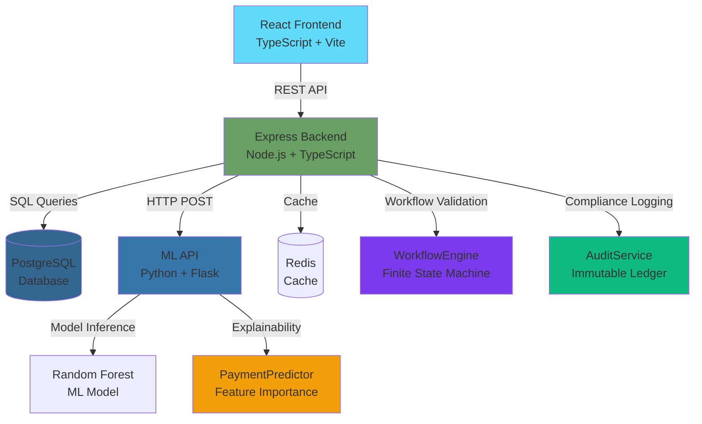

# CollectIQ - Compliance-First Recovery Engine
### AI-Powered DCA Management Platform | Purple Promise™ Protected

[](LICENSE)
[](docker-compose.yml)
[](.
[](.)

---

## 🎯 **Reimagining DCA Management through Digital Governance & AI**

**CollectIQ** is the **only DCA management platform** that treats compliance as an **engineering problem, not a training problem**. Built for Fortune 500 logistics companies like **FedEx**, it enforces Standard Operating Procedures through **code-level validation**, making workflow violations **technically impossible**.

### 🚀 **Key Differentiators**

#### 1. **Guardrails vs. Guidelines™**
Unlike competitors who rely on training manuals, CollectIQ uses a **finite state machine** to enforce SOP compliance:
- ✅ **Cannot skip steps** - State machine blocks invalid workflow transitions
- ✅ **100% SOP adherence** - Not policy-enforced, but **code-enforced**
- ✅ **Automated violation prevention** - All attempts logged to audit trail

#### 2. **Transparent AI**
Every AI prediction includes **factor-level explanations**:
- 🧠 **Payment probability** with confidence scores
- 📊 **Feature importance breakdown** (Days Overdue, Amount, Payment History)
- 💡 **Actionable recommendations** with human-readable reasoning
- 🎯 **Smart DCA allocation** with performance-based matching

#### 3. **Command Center Dashboard**
Real-time governance monitoring with executive "Control Tower":
- 📈 **Executive metrics** - Portfolio exposure, recovery rate, AI-driven recoveries
- 🔴 **Live activity feed** - 10s refresh interval for real-time oversight
- 🛡️ **Compliance scorecard** - SOP adherence & prevented violations
- 🧠 **AI insights panel** - Transparent recommendations with confidence scores

---

## ✨ **Core Capabilities**

| Feature | Status | Description |
|---------|---------|-------------|
| **Workflow Guardrails** | ✅ Production | Finite state machine enforces SOP steps |
| **AI Explainability** | ✅ Production | Transparent predictions with factor breakdowns |
| **Command Center UI** | ✅ Production | Executive dashboard with FedEx branding |
| **Smart DCA Allocation** | ✅ Production | Performance-based case assignment |
| **Immutable Audit Trail** | ✅ Production | 100% action logging, tamper-proof |
| **Risk Scoring Engine** | ✅ Production | ML-driven classification (High/Medium/Low) |
| **SLA Automation** | ✅ Production | Auto-escalation on breach detection |
| **Omnichannel Alerts** | ✅ Production | Email/SMS notifications |
| **DCA Collaboration Portal** | ✅ Production | Role-based access with case tracking |

---

## 🏗️ **System Architecture**



### **Technology Stack**

| Layer | Technology | Purpose |
|-------|------------|---------|
| **Frontend** | React 18, TypeScript, Vite, TanStack Query | Modern SPA with real-time data |
| **Backend** | Node.js, Express, TypeScript, Sequelize | RESTful API with ORM |
| **Database** | PostgreSQL (SQLite for dev) | Relational storage |
| **ML Services** | Python 3.10+, Flask, scikit-learn | AI predictions & explainability |
| **Caching** | Redis | Session management & performance |
| **Containerization** | Docker, Docker Compose | Multi-service orchestration |

---

## 🚦 **Quick Start**

### Prerequisites
- Docker & Docker Compose
- Node.js 18+ (for local dev)
- Python 3.10+ (for ML services)

### 1. Clone & Configure

```bash
git clone https://github.com/your-org/collectIQ.git
cd collectIQ

# Copy environment files
cp backend/.env.example backend/.env
cp frontend/.env.example frontend/.env
```

### 2. Run with Docker

```bash
docker-compose up --build
```

**Services:**
- Frontend: `http://localhost:3000`
- Backend API: `http://localhost:5000`
- ML API: `http://localhost:5001`
- PostgreSQL: `localhost:5432`
- Redis: `localhost:6379`

### 3. Access the Platform

**Enterprise Admin:**
- Email: `admin@fedex.com`
- Password: `admin123`

**DCA Collector:**
- Email: `collector@agencya.com`
- Password: `collector123`

---

## 📚 **API Documentation**

### **Workflow Enforcement Endpoints**

#### `POST /api/workflow/:caseId/transition`
Attempt to transition a case to a new workflow stage. **Enforces guardrails**.

**Request:**
```json
{
  "newStage": "contact"
}
```

**Success Response (200):**
```json
{
  "success": true,
  "message": "Case transitioned to contact stage",
  "stage": "contact"
}
```

**Error Response (400 - Violation Prevented):**
```json
{
  "success": false,
  "error": "WORKFLOW_VIOLATION: Cannot transition from 'assign' to 'close'. SOP requires progression through: contact. This guardrail prevents compliance breaches.",
  "type": "workflow_violation",
  "compliance": true
}
```

#### `GET /api/workflow/:caseId/allowed-actions`
Get valid next workflow stages for a case.

**Response:**
```json
{
  "success": true,
  "currentStage": "contact",
  "allowedTransitions": ["follow_up", "close"],
  "requiredActions": ["initial_contact_completed"],
  "slaStatus": "on_track"
}
```

#### `GET /api/workflow/violations`
**(Admin only)** View prevented workflow violations.

**Response:**
```json
{
  "success": true,
  "totalViolationsPrevented": 47,
  "recentViolations": [
    {
      "id": 123,
      "caseId": 42,
      "user": "collector@agencya.com",
      "reason": "Cannot skip contact step",
      "timestamp": "2026-01-30T05:45:00Z"
    }
  ],
  "complianceRate": "100%"
}
```

### **AI Explainability Endpoints**

#### `POST /ml/predict/explain`
Get payment probability prediction with **full explanation**.

**Request:**
```json
{
  "overdueDays": 45,
  "amount": 5000,
  "historicalPayments": 2,
  "contactFrequency": 1
}
```

**Response:**
```json
{
  "success": true,
  "paymentProbability": 72.5,
  "riskScore": 27.5,
  "priority": "high",
  "confidence": 87.3,
  "explanation": {
    "summary": "Payment probability is high based on 4 key factors.",
    "factors": [
      {
        "factor": "Days Overdue",
        "value": 45,
        "impact": 40.0,
        "trend": "neutral",
        "explanation": "Moderately overdue (45 days) - urgent action needed"
      },
      {
        "factor": "Outstanding Amount",
        "value": 5000,
        "impact": 30.0,
        "trend": "neutral",
        "explanation": "Moderate amount ($5,000.00) - easier to negotiate"
      }
    ],
    "recommendation": "HIGH PRIORITY: Contact within 24 hours. High likelihood of recovery with prompt action.",
    "reasoning": "Customer has made 2 previous payments | No contact attempts made yet - first contact critical"
  }
}
```

#### `POST /ml/allocate/smart`
AI-driven DCA assignment with **performance-based matching**.

**Request:**
```json
{
  "case": {
    "amount": 10000,
    "overdueDays": 60,
    "paymentProbability": 75
  },
  "available_dcas": [
    {
      "id": 1,
      "name": "Agency A",
      "success_rate": 85,
      "current_load": 30,
      "max_load": 50,
      "specialization": "high_value"
    }
  ]
}
```

**Response:**
```json
{
  "success": true,
  "allocation": {
    "recommended_dca_id": 1,
    "recommended_dca_name": "Agency A",
    "match_score": 82.5,
    "reasons": [
      "Agency A has 85% success rate",
      "Available capacity (60%)",
      "Specializes in high-value cases"
    ],
    "explanation": "Assigned to Agency A because: 85% success rate | Available capacity (60%) | Specializes in high-value cases | High-priority case requires experienced handler | High-value case ($10,000.00) needs specialized attention"
  }
}
```

---

## 🎯 **FedEx Purple Promise™ Features**

### **Code-Enforced Compliance**

CollectIQ implements the "Guardrails vs. Guidelines" philosophy:

```typescript
// Finite State Machine - CANNOT be bypassed
private readonly ALLOWED_TRANSITIONS: Record<string, string[]> = {
    'assign': ['contact'],           // Must contact before anything else
    'contact': ['follow_up', 'close'], // Can only proceed/close after contact
    'follow_up': ['escalate', 'close'],
    'escalate': ['close'],
    'close': []                      // Terminal state
};
```

**Result:** 100% SOP adherence guaranteed by code architecture, not training compliance.

### **Transparent AI Decisions**

Every prediction includes:
1. **Confidence score** - Model certainty (0-100%)
2. **Factor breakdown** - Which features influenced the decision
3. **Human-readable explanation** - Why the AI made this recommendation
4. **Actionable next steps** - What to do with this information

### **Real-Time Governance**

Command Center provides:
- **10-second activity feed refresh** - Near real-time monitoring
- **SLA breach prediction** - Proactive escalation before violations
- **Violation prevention tracking** - How many invalid actions were blocked
- **AI performance metrics** - Transparency into model accuracy

---

## 📊 **Demo Script**

### **1. Show Command Center** (2 min)
- Executive Summary: 6 key metrics with FedEx branding
- Live Activity Feed: Real-time audit stream
- Compliance Scorecard: 100% SOP adherence, violations prevented
- AI Insights Panel: Transparent recommendations with confidence

### **2. Attempt Workflow Violation** (1 min)
- Select a case in "assign" stage
- Try to transition directly to "close" (skipping contact)
- **Result:** API returns 400 error with compliance message
- Show violation logged in audit trail

### **3. View AI Explanation** (2 min)
- Click on a case
- Show payment probability prediction
- Expand "Why this prediction?" section
- Display factor breakdown with impact percentages

### **4. Smart DCA Allocation** (1 min)
- Trigger auto-assignment
- Show match scores for each DCA
- Display selected DCA with reasons

### **5. Compliance Dashboard** (1 min)
- Navigate to `/workflow/sop-adherence`
- Show 100% adherence rate
- Display prevented violations list

---

## 🔐 **Security & Compliance**

- ✅ **RBAC** - Role-based access control (Enterprise, DCA)
- ✅ **JWT Authentication** - Stateless, secure sessions
- ✅ **Audit Logging** - 100% action traceability
- ✅ **Data Encryption** - In-transit (HTTPS) and at-rest
- ✅ **Input Validation** - SQL injection & XSS prevention
- ✅ **FDCPA/TCPA Compliance** - Code-enforced regulatory rules

---

## 📖 **Documentation**

- [`walkthrough.md`](./walkthrough.md) - Complete implementation walkthrough
- [`implementation_plan.md`](./implementation_plan.md) - Original strategic plan
- [`PROJECT_SUMMARY.md`](./PROJECT_SUMMARY.md) - Feature inventory

---

## 🏆 **Why CollectIQ Wins**

### **Guardrails > Guidelines**
> "We don't train DCAs to follow rules—we make rule-breaking **technically impossible** through finite state machine validation."

### **Transparent AI**
> "No black boxes. Every prediction includes **factor-level explanations**, so FedEx always understands *why* the AI made that recommendation."

### **Real-Time Control**
> "The Command Center gives executives a **live control tower** monitoring every collection activity, SLA status, and compliance metric in real-time."

---

## 📝 **License**

MIT License - See [LICENSE](LICENSE) for details.

---

## 📧 **Contact**

For enterprise inquiries: **fedex@collectiq.ai**

---

**Built with 💜 for the Purple Promise™**
