# AI Compliance Decision System - Quick Reference

## 📋 Problem Statement

**In 3 Lines**:
1. Current debt collection AI optimizes for recovery but lacks autonomous compliance/ethical validation
2. Human oversight is inconsistent, causing regulatory violations (TCPA, FDCPA) and ethical harm
3. Our AI decides "what should be done" by blocking illegal actions, scoring ethical harm, and explaining decisions in judge-friendly language

---

## 🏗️ System Architecture

---

## 🔄 Decision Flow (Step-by-Step)

### Main Flow

```mermaid
flowchart TD
    Start([Collector requests<br/>AI recommendation]) --> GetContext[Retrieve case context<br/>consent, contact history,<br/>vulnerability flag]
    
    GetContext --> MLPredict[ML prediction<br/>payment probability,<br/>risk score]
    
    MLPredict --> ProposeAction[Propose recommended<br/>action e.g. send_sms]
    
    ProposeAction --> ComplianceCheck{Compliance<br/>Rules Check}
    
    ComplianceCheck -->|FAIL| Blocked[🚫 DECISION: BLOCKED]
    ComplianceCheck -->|PASS| EthicalCheck[Calculate ethical<br/>risk score]
    
    EthicalCheck --> RiskEval{Ethical Risk<br/>Score}
    
    RiskEval -->|> 70| DoNotProceed[❌ DECISION:<br/>DO_NOT_PROCEED]
    RiskEval -->|40-70| ReviewReq[⚠️ DECISION:<br/>REVIEW_REQUIRED]
    RiskEval -->|< 40| Allowed[✅ DECISION:<br/>ALLOWED]
    
    Blocked --> GenExplanation[Generate explanation<br/>with alternatives]
    DoNotProceed --> GenExplanation
    ReviewReq --> GenExplanation
    Allowed --> GenExplanation
    
    GenExplanation --> LogAudit[Log to decision_audit<br/>immutable trail]
    
    LogAudit --> DisplayUI[Display to user<br/>with visual indicators]
    
    DisplayUI --> UserAction{User action}
    
    UserAction -->|Accept| Execute[Execute action]
    UserAction -->|Override| OverrideFlow[Require justification<br/>+ supervisor approval]
    UserAction -->|Wait| End1([Decision logged,<br/>no action])
    
    OverrideFlow --> LogOverride[Log override to<br/>decision_overrides]
    LogOverride --> Execute
    
    Execute --> End2([Action executed,<br/>audit complete])
    
    style Blocked fill:#ff6b6b,color:#fff
    style DoNotProceed fill:#ff6b6b,color:#fff
    style ReviewReq fill:#feca57
    style Allowed fill:#1dd1a1,color:#fff
    style LogAudit fill:#ee5a6f,color:#fff
```

### Compliance Check Detail

```mermaid
flowchart LR
    A[Proposed Action] --> B[Contact Time<br/>Window Check]
    B --> C[Channel Frequency<br/>Limit Check]
    C --> D[Consent<br/>Validation Check]
    D --> E[Dispute Handling<br/>Check]
    E --> F[Vulnerable Debtor<br/>Protection Check]
    
    F --> G{All checks<br/>passed?}
    
    G -->|Yes| H[✅ PASSED]
    G -->|No| I[❌ FAILED]
    
    I --> J[Collect violated<br/>rules]
    J --> K[Suggest compliant<br/>alternatives]
    
    style I fill:#ff6b6b,color:#fff
    style H fill:#1dd1a1,color:#fff
```

---

## 📊 Sample Outputs Summary

| Case ID | Scenario | Decision | Compliance Status | Ethical Risk | Key Reason |
|---------|----------|----------|-------------------|--------------|------------|
| **CASE-10045** | 32 days overdue, low contact | ✅ ALLOWED | PASSED | 22 (Low) | All rules passed, low harm |
| **CASE-10078** | 67 days overdue, disputed debt | 🚫 BLOCKED | FAILED | 76 (High) | TCPA violation + debt disputed |
| **CASE-10112** | 95 days overdue, vulnerable | ⚠️ REVIEW REQUIRED | PASSED (warnings) | 48 (Medium) | Vulnerable debtor protection |

**See full decision outputs in implementation_plan.md**

---

## ⚖️ Compliance Rules (Top 5)

### 1. Contact Time Window Rule
- **Regulation**: FDCPA 15 USC § 1692c(a)(1)
- **Rule**: No calls/SMS before 8 AM or after 9 PM (debtor local time)
- **Enforcement**: Hard block (cannot override)

### 2. Channel Frequency Limits
- **Regulation**: CFPB Regulation F 12 CFR § 1006.14
- **Limits**:
  - Phone: 3 calls per 7 days
  - SMS: 1 per day
  - Email: 2 per 7 days
- **Enforcement**: Hard block when exceeded

### 3. Consent Validation
- **Regulation**: TCPA 47 USC § 227
- **Rule**: SMS/autodialer requires prior express consent
- **Enforcement**: Hard block (TCPA penalty: $500-$1,500 per message)

### 4. Dispute Handling
- **Regulation**: FDCPA 15 USC § 1692g(b)
- **Rule**: Cease collection if debt disputed until validation provided
- **Enforcement**: Hard block (no override allowed)

### 5. Vulnerable Debtor Protection
- **Regulation**: Company Policy + State Laws (CA, NY)
- **Rule**: Mandatory supervisor approval for vulnerable consumers
- **Categories**: Medical hardship, elderly, disabilities, recent hardship
- **Enforcement**: Requires human review

**See 45+ additional rules in implementation_plan.md**

---

## 🧭 Ethical Principles (Top 6)

| Principle | Definition | Enforcement |
|-----------|------------|-------------|
| **Least Harmful Action** | Choose lowest ethical risk among compliant options | Automatic ranking |
| **Consent-First** | Never use non-consented channels | Hard block |
| **Transparency** | No misleading urgency or false threats | Content validation |
| **Vulnerable Protection** | Enhanced protections for vulnerable debtors | Mandatory approval |
| **Graduated Response** | Escalate progressively, not immediately | Stage validation |
| **Proportionality** | Effort matches debt size and debtor capacity | Small debt protections |

**See detailed formulas in implementation_plan.md**

---

## 🎬 3-Minute Demo Flow (Hackathon)

### Slide 1: Problem (30s)
- Show traditional system allowing TCPA violation
- Show CollectIQ blocking it before execution

### Slide 2: Demo 1 - Blocked Action (60s)
- Case: Disputed debt + no SMS consent
- AI blocks: TCPA + FDCPA violations
- Shows: Legal citations, required alternative

### Slide 3: Demo 2 - Vulnerable Debtor (60s)
- Case: Elderly medical hardship patient
- AI requires: Supervisor approval
- Shows: Ethical risk breakdown, approval workflow

### Slide 4: Architecture (30s)
- 5-layer system diagram
- Compliance → Ethical → Explainable → Human → Audit

### Slide 5: Value Prop (30s)
- Metrics: 100% compliance, 60% efficiency, full audit trail
- Tagline: **"An AI that knows when NOT to act"**

---

## 🏆 Why It's Hard to Replicate

| Feature | Time to Replicate | Our Secret Sauce |
|---------|-------------------|------------------|
| Compliance Rules (50+) | 2-3 months | Legal expertise + CFR citations |
| Ethical Harm Scoring | 3-4 months | Custom ML, not off-the-shelf |
| Explainable AI | 4-6 months | Judge-friendly NLG with statute refs |
| Vulnerable Debtor Logic | 2-3 months | 5 categories, mandatory workflows |
| Audit Trail | 1-2 months | Full reasoning logged, not just action |
| Human Override UX | 1-2 months | Friction design, behavioral economics |
| **TOTAL** | **12-18 months** | **Integrated from day 1** |

**Key Differentiator**: We built compliance **into** the decision architecture, not as a post-processing layer. Competitors would need to refactor their entire ML pipeline.

---

## ✅ Deliverables Completed

- [x] Problem statement (2-3 lines)
- [x] System architecture (textual + diagrams)
- [x] Decision flow (step-by-step flowcharts)
- [x] Sample AI decision output for 3 cases
- [x] Compliance rule examples (50+ rules documented)
- [x] Ethical principles enforced (6 core principles)
- [x] Demo flow for 3-minute presentation
- [x] Competitive differentiation analysis

**All deliverables ready for review in `implementation_plan.md`**

---

## 📞 Next Steps

1. **Review**: User reviews implementation plan
2. **Feedback**: Incorporate any adjustments
3. **Implement**: Build Python compliance modules + API routes (if approved)
4. **Demo**: Create presentation deck and demo video

**Status**: ✅ Design complete, ready for review
